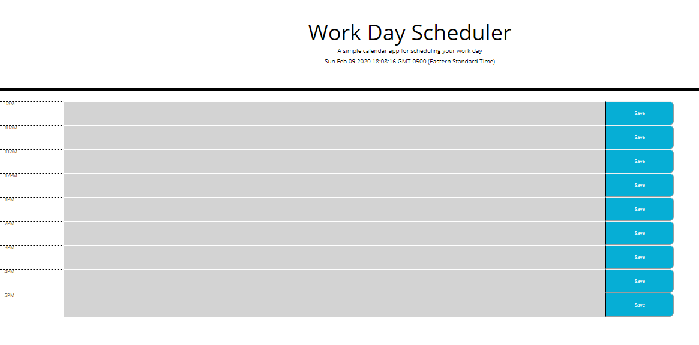

# dayPlanner

## Create a day planner that shows current hour highlighted and grays out past events. This is just for the work day of 9 a.m. to 5 p.m.. You must be able to add and save events for each hour of the work day.

* The URL of the GitHub repository

https://github.com/Findjules2/dayPlanner

* The URL of the deployed application

https://findjules2.github.io/dayPlanner/

